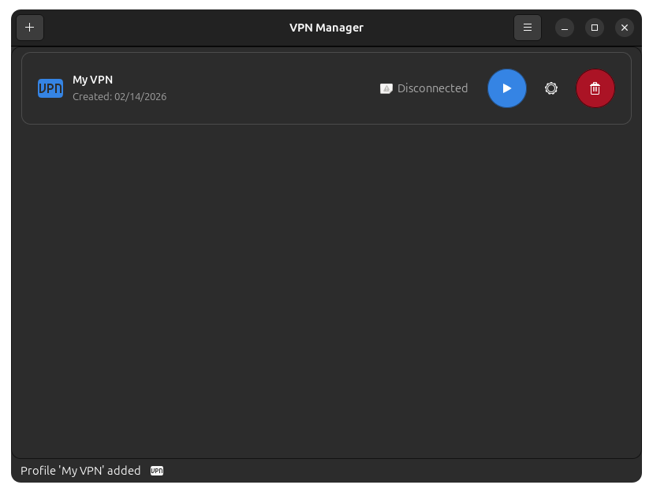

<p align="center">
  
</p>

<h1 align="center">VPN Manager</h1>

<p align="center">
  <strong>Modern and elegant OpenVPN client for Linux</strong>
</p>

<p align="center">
  <a href="#features">Features</a> •
  <a href="#installation">Installation</a> •
  <a href="#usage">Usage</a> •
  <a href="#building">Building</a> •
  <a href="#contributing">Contributing</a>
</p>

<p align="center">
  
  
  
  
  
</p>

---

## About

**VPN Manager** is a modern, user-friendly desktop application designed to manage VPN connections on Linux systems using OpenVPN. With a native GTK4/libadwaita interface, it integrates seamlessly with the GNOME desktop and other modern environments.

<p align="center">
  
</p>

## Features

### 🔐 Profile Management
- **Multiple VPN profiles** - Organize and manage multiple VPN configurations
- **Import .ovpn files** - Easily import existing OpenVPN configuration files
- **Secure credentials** - Encrypted password storage using the system keyring

### 🌐 Advanced Connectivity
- **Split Tunneling** - Configure which traffic goes through the VPN
  - Include mode: only specified traffic uses the VPN
  - Exclude mode: all traffic except specified uses the VPN
- **OTP Support** - Two-factor authentication with one-time passwords
- **Auto-reconnect** - Automatically restores connection if lost

### 🎨 Modern Interface
- **GTK4 + libadwaita** - Native interface following GNOME design guidelines
- **Light/Dark themes** - Automatically follows system theme
- **System tray** - Quick access from the system indicator
- **Native notifications** - Connection/disconnection alerts

### 📊 Real-Time Monitoring
- **Connection status** - View current state of each profile
- **Network statistics** - Monitor bytes sent/received
- **Assigned IP address** - Shows current VPN IP

### ⚙️ Flexible Configuration
- **Auto-start** - Option to start with the system
- **Minimize to tray** - Keep the app accessible without taking space
- **YAML configuration** - Human-readable and editable config files

## System Requirements

### Dependencies

| Component | Minimum Version | Description |
|-----------|-----------------|-------------|
| **Operating System** | Ubuntu 22.04+ / Fedora 38+ | Or any distribution with GTK4 |
| **OpenVPN** | 2.5+ or OpenVPN3 | Underlying VPN client |
| **GTK4** | 4.0+ | GUI framework |
| **libadwaita** | 1.0+ | GNOME styling library |
| **libsecret** | 0.20+ | Secure credential storage (recommended) |


## Building

### Build Requirements

- **Go** 1.24 or higher
- **GCC** (C compiler)
- **GTK4 development libraries**

```bash
# Ubuntu/Debian
sudo apt install golang gcc libgtk-4-dev libadwaita-1-dev

# Fedora
sudo dnf install golang gcc gtk4-devel libadwaita-devel

# Arch Linux
sudo pacman -S go gcc gtk4 libadwaita
```

### Build from Source

```bash
# Clone the repository
git clone https://github.com/yllada/vpn-manager.git
cd vpn-manager

# Download dependencies
go mod download

# Build
go build -o vpn-manager .

# Run
./vpn-manager
```

### Build DEB Package

```bash
# Run the packaging script
./scripts/build-deb.sh 1.0.0

# The package will be in build/
```

## Contributing

Contributions are welcome! Please follow these steps:

1. **Fork** the repository
2. **Create** a branch for your feature (`git checkout -b feature/new-feature`)
3. **Commit** your changes (`git commit -am 'Add new feature'`)
4. **Push** to the branch (`git push origin feature/new-feature`)
5. Open a **Pull Request**

### Guidelines

- Follow the existing code style
- Add comments documenting public functions
- Include tests when applicable
- Update documentation if necessary

## Roadmap

- [ ] WireGuard support
- [ ] Bulk profile import
- [ ] Historical connection statistics
- [ ] Multi-language support
- [ ] Configuration export/import
- [ ] NetworkManager integration

## License

This project is licensed under the **MIT License** - see the [LICENSE](LICENSE) file for details.

```
MIT License

Copyright (c) 2026 Yadian Llada Lopez

Permission is hereby granted, free of charge, to any person obtaining a copy
of this software and associated documentation files (the "Software"), to deal
in the Software without restriction...
```

## Author

**Yadian Llada Lopez**

- GitHub: [@yllada](https://github.com/yllada)

---

<p align="center">
  Made with ❤️ for the Linux community
</p>
