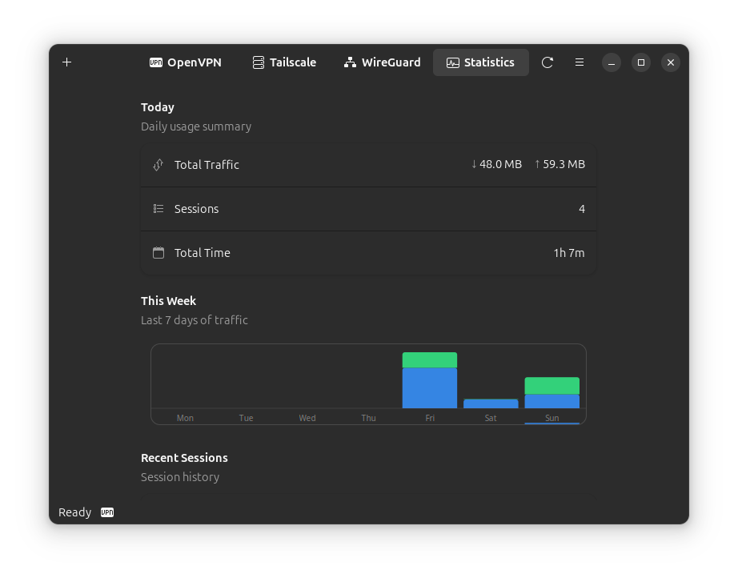

<p align="center">
  
</p>

<h1 align="center">VPN Manager</h1>

<p align="center">
  <strong>A GTK4 VPN client for Linux with enterprise-grade security features</strong><br>
  <em>OpenVPN, WireGuard & Tailscale in one native interface</em>
</p>

<p align="center">
  <a href="https://yllada.github.io/vpn-manager/"><strong>🌐 Landing Page</strong></a> •
  <a href="#installation"><strong>📦 Install</strong></a> •
  <a href="#features"><strong>✨ Features</strong></a>
</p>

<p align="center">
  <a href="https://github.com/yllada/vpn-manager/actions/workflows/ci.yml"></a>
  
  
  
  
</p>

<p align="center">
  
</p>

---

## Why VPN Manager?

Most Linux VPN solutions require terminal commands or lack modern security features. VPN Manager provides a native GTK4/libadwaita interface with enterprise security that works out of the box.

## Features

### Multi-Protocol Support

| Protocol | Features |
|----------|----------|
| **OpenVPN** | `.ovpn` import, credentials in system keyring, OTP support |
| **WireGuard** | `.conf` import, wg-quick integration, interface stats from `/sys/class/net` |
| **Tailscale** | Exit nodes with Mullvad filter, Taildrop file transfer, advanced options (Exit Node advertising, Shields Up, SSH), LAN Gateway mode |

### Security

- **Kill Switch** — Three modes (Off/Auto/Always) with iptables + nftables backends
  - Configure via Preferences → Security tab (no config file editing required)
  - LAN access control (RFC1918 bypass)
  - State persistence with crash recovery
  - Block-all mode for untrusted network failures
- **DNS Leak Protection** — systemd-resolved strict mode with firewall fallback
  - Choose DNS provider: System, Cloudflare, Google, or Custom
  - DoH/DoT blocking on non-VPN interfaces
  - Configure via UI Preferences → Security tab
  - Pause mode for captive portal authentication
- **IPv6 Leak Protection** — Four protection modes (Allow, Block, Disable, Auto)
  - Optional WebRTC STUN/TURN blocking
  - Configure via UI Preferences → Security tab
- **Evil Twin Detection** — Warns when a known SSID appears with different BSSID

### Network Trust Management

Automatic VPN connection based on network classification:

| Trust Level | Action |
|-------------|--------|
| Trusted | VPN disconnects (home, office) |
| Untrusted | VPN connects automatically (public WiFi) |
| Unknown | Prompts for classification |

Features:
- Per-network VPN profile override
- SSID + BSSID matching
- Kill switch on connection failure for untrusted networks

### Split Tunneling

**Network-based** (IP/CIDR routes):
- Include mode: only listed routes through VPN
- Exclude mode: all traffic except listed routes

**Per-app tunneling** (cgroup-based):
- net_cls (v1) + cgroup v2 support
- Policy routing with custom table + fwmark
- Split DNS via DNAT

### Traffic Statistics

- SQLite-based session tracking with configurable retention
- Real-time bandwidth and latency monitoring
- Connection quality indicators (Good/Degraded/Poor based on latency)
- Historical data: daily summaries, per-profile stats

<p align="center">
  
</p>

### Health Monitoring

- Multi-probe chain: TCP → ICMP → HTTP fallback
- Auto-reconnect with configurable attempts
- OTP callback support (no auto-reconnect when OTP required)

### Tailscale Features

- **Taildrop** — Send files to any online Tailscale device with one click
  - Auto-receive to `~/Downloads/Taildrop` with desktop notifications
  - Configure via `TaildropDir` and `TaildropAutoReceive` in `config.yaml`
- **Advanced Options** — Accessible via Preferences → VPN Providers → Tailscale
  - **Advertise Exit Node**: Share your machine as VPN exit for other devices
  - **Shields Up**: Block all incoming Tailscale connections
  - **SSH**: Enable Tailscale SSH (applies on next connect)
- **Exit Nodes** — Mullvad exit node filter for privacy-focused routing

## Architecture

VPN Manager uses a daemon architecture for privilege separation:

```
┌─────────────────┐     Unix Socket      ┌──────────────────┐
│  vpn-manager    │ ◄──────────────────► │  vpn-managerd    │
│  (GUI, user)    │                      │  (root daemon)   │
└─────────────────┘                      └──────────────────┘
                                                  │
                                    ┌─────────────┼─────────────┐
                                    ▼             ▼             ▼
                              iptables/      wg-quick      openvpn
                               nftables      tailscale     sysctl
```

The daemon handles all privileged operations: firewall rules, VPN process management, DNS configuration, and cgroup setup for per-app tunneling.

## Installation

### Requirements

- GTK4 4.14+, libadwaita 1.5+
- Linux (Ubuntu 24.04+, Fedora 40+, Arch)
- At least one VPN backend: OpenVPN, WireGuard (`wg-quick`), or Tailscale

### Ubuntu/Debian

```bash
curl -fsSL https://yllada.github.io/vpn-manager/apt/gpg.key | sudo gpg --dearmor -o /usr/share/keyrings/vpn-manager.gpg
echo "deb [signed-by=/usr/share/keyrings/vpn-manager.gpg] https://yllada.github.io/vpn-manager/apt stable main" | sudo tee /etc/apt/sources.list.d/vpn-manager.list
sudo apt update && sudo apt install vpn-manager
```

### Fedora/RHEL

```bash
wget https://github.com/yllada/vpn-manager/releases/latest/download/vpn-manager-*.x86_64.rpm
sudo dnf install ./vpn-manager-*.x86_64.rpm
```

### Build from Source

```bash
# Dependencies (Ubuntu/Debian)
sudo apt install golang gcc libgtk-4-dev libadwaita-1-dev

# Build
git clone https://github.com/yllada/vpn-manager.git
cd vpn-manager
go build -o vpn-manager .

# Install daemon (required for privileged operations)
cd build && sudo ./install-daemon.sh
```

<details>
<summary>Other distributions</summary>

```bash
# Fedora
sudo dnf install golang gcc gtk4-devel libadwaita-devel

# Arch
sudo pacman -S go gcc gtk4 libadwaita
```
</details>

### Daemon Management

```bash
sudo systemctl status vpn-managerd   # Check status
sudo journalctl -u vpn-managerd -f   # View logs
sudo systemctl restart vpn-managerd  # Restart
```

## Configuration

| Path | Description |
|------|-------------|
| `~/.config/vpn-manager/profiles/` | OpenVPN profiles |
| `~/.config/vpn-manager/wireguard/` | WireGuard configs |
| `~/.config/vpn-manager/config.yaml` | App settings |
| `~/.config/vpn-manager/trust-rules.yaml` | Network trust rules |
| `~/.local/share/vpn-manager/stats.db` | Usage statistics (SQLite) |

## Contributing

See [CONTRIBUTING.md](CONTRIBUTING.md). We follow [Conventional Commits](https://www.conventionalcommits.org/).

## License

[MIT](LICENSE) — Yadian Llada Lopez

---

<p align="center">
  Made with care for the Linux community
</p>
