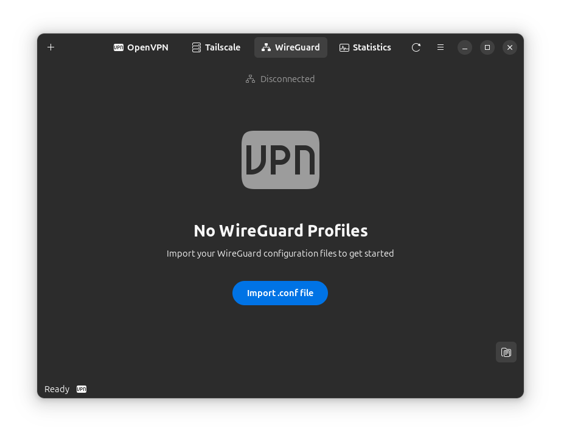

<p align="center">
  
</p>

<h1 align="center">VPN Manager</h1>

<p align="center">
  <strong>Enterprise-grade security, community-first freedom</strong><br>
  <em>Simple VPN client for Linux with GUI — OpenVPN, WireGuard & Tailscale</em>
</p>

<p align="center">
  <a href="https://github.com/yllada/vpn-manager/actions/workflows/ci.yml"></a>
  
  
  
</p>

<p align="center">
  
</p>


---

## Why?

Most VPN clients on Linux require terminal knowledge. **VPN Manager** lets you connect to your VPN with a simple click — no CLI needed.

## Features

- **Modern libadwaita UI** — Native GNOME experience with responsive layout
- **Dark/Light theme support** — Follows system preference with accent color support
- **GNOME HIG compliant** — Consistent with modern GNOME design guidelines
- **OpenVPN, WireGuard, Tailscale** — All in one app
- **Import .ovpn files** — Drag and drop configuration
- **Secure credentials** — Stored in system keyring
- **Split tunneling** — Choose what traffic goes through VPN
- **Auto-reconnect** — Restores connection if lost
- **System tray** — Quick access without opening the app
- **Network Trust Rules** — Auto-manage VPN based on network trust (connect on untrusted, disconnect on trusted)

### Security Features

VPN Manager provides enterprise-grade security that matches ProtonVPN and NordVPN:

- **DNS Leak Protection** — systemd-resolved strict mode with firewall fallback
- **IPv6 Leak Protection** — Extended sysctl parameters and nftables inet rules
- **Enterprise Kill Switch** — State persistence, crash recovery, and boot-persistent protection via systemd
  - LAN access toggle while kill switch is enabled
  - Pause/resume mode for captive portal authentication
- **Evil Twin Detection** — Warns if a known network appears with a different access point
- **Network-based Kill Switch** — Blocks traffic if VPN fails on untrusted networks

### Traffic Statistics (Unique Feature)

**No other Linux VPN client offers this.** VPN Manager includes comprehensive traffic visualization:

- **Real-time quality indicators** — Latency, jitter, and bandwidth monitoring
- **Live bandwidth graph** — Cairo-rendered real-time visualization
- **Weekly traffic charts** — Bar chart visualization of usage patterns
- **Session history** — Detailed metrics with 90-day SQLite-based retention
- **Pure Go implementation** — No CGO required (modernc.org/sqlite)

## Network Trust Rules

Automatically manage your VPN connection based on network trust levels:

| Trust Level | Behavior |
|-------------|----------|
| **Trusted** | VPN disconnects automatically (home, office) |
| **Untrusted** | VPN connects automatically (public WiFi, hotels) |
| **Unknown** | Prompts you to classify the network |

### Quick Actions
- Right-click the tray icon → "Trust/Untrust This Network"
- Preferences → Network Trust → Manage Rules

## Installation

### Requirements

- **GTK4 4.14+**
- **libadwaita 1.5+**
- **Go 1.21+**
- Linux (Ubuntu 24.04+, Fedora 40+, Arch)
- OpenVPN, WireGuard, or Tailscale installed

### Build from Source

```bash
# Install dependencies (Ubuntu/Debian)
sudo apt install golang gcc libgtk-4-dev libadwaita-1-dev

# Clone and build
git clone https://github.com/yllada/vpn-manager.git
cd vpn-manager
go build -o vpn-manager .

# Run
./vpn-manager
```

<details>
<summary>Other distributions</summary>

```bash
# Fedora
sudo dnf install golang gcc gtk4-devel libadwaita-devel

# Arch Linux
sudo pacman -S go gcc gtk4 libadwaita
```
</details>

## CLI Usage

```bash
vpn-manager --list                    # List profiles
vpn-manager --connect "My VPN"        # Connect
vpn-manager --disconnect all          # Disconnect all
vpn-manager --status                  # Show status
vpn-manager --status --json           # JSON output for scripting
vpn-manager --tui                     # Launch interactive TUI
vpn-manager --recover-killswitch      # Recover kill switch after crash
vpn-manager --disable-killswitch      # Disable kill switch
```

<details>
<summary>All CLI options</summary>

| Flag | Description |
|------|-------------|
| `--version` | Show version |
| `--help` | Show help |
| `--verbose` | Enable verbose logging |
| `--list` | List all VPN profiles |
| `--connect NAME` | Connect to a profile |
| `--disconnect NAME\|all` | Disconnect from profile(s) |
| `--status` | Show connection status |
| `--json` | Output in JSON format (for scripting) |
| `--tui` | Launch interactive terminal UI |
| `--run COMMAND` | Run command through VPN tunnel |
| `--list-apps` | List apps for split tunneling |
| `--recover-killswitch` | Recover kill switch state after crash |
| `--disable-killswitch` | Force disable kill switch |
</details>

## Interactive TUI

Launch a full terminal interface with `--tui`:

```bash
vpn-manager --tui
```

The TUI provides a dashboard view with real-time connection status and a profile selector with fuzzy search.

### TUI Keyboard Shortcuts

| Key | Action |
|-----|--------|
| `Tab` | Switch between Dashboard and Profiles |
| `c` | Connect to selected profile |
| `d` | Disconnect |
| `j/k` or arrows | Navigate list |
| `/` | Filter profiles (fuzzy search) |
| `Enter` | Select profile |
| `?` | Toggle help |
| `Esc` | Cancel/back |
| `q` | Quit |

## Configuration

- **Profiles**: `~/.config/vpn-manager/profiles/`
- **Settings**: `~/.config/vpn-manager/config.yaml`
- **Logs**: `~/.config/vpn-manager/logs/`
- **Trust Rules**: `~/.config/vpn-manager/trust-rules.yaml`
- **Statistics**: `~/.config/vpn-manager/stats.db` (SQLite, 90-day retention)
- **Kill Switch State**: `~/.config/vpn-manager/killswitch-state.json`

## Contributing

See [CONTRIBUTING.md](CONTRIBUTING.md). Please follow [Conventional Commits](https://www.conventionalcommits.org/).

## License

[MIT](LICENSE) — Yadian Llada Lopez

---

<p align="center">
  Made with care for the Linux community
</p>
