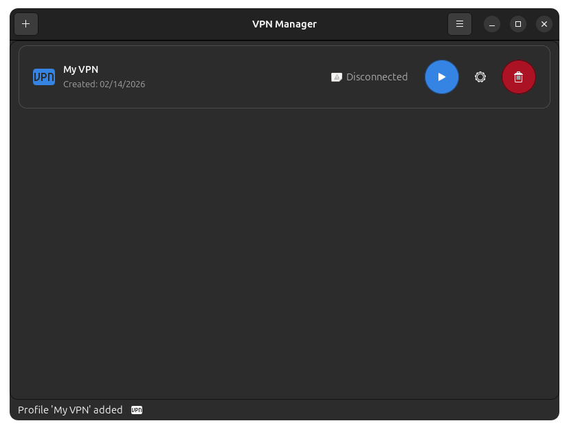

<p align="center">
  
</p>

<h1 align="center">VPN Manager</h1>

<p align="center">
  <strong>Simple VPN client for Linux with GUI — OpenVPN, WireGuard & Tailscale</strong>
</p>

<p align="center">
  <a href="https://github.com/yllada/vpn-manager/actions/workflows/ci.yml"></a>
  
  
  
</p>

<p align="center">
  
</p>

---

## Why?

Most VPN clients on Linux require terminal knowledge. **VPN Manager** lets you connect to your VPN with a simple click — no CLI needed.

## Features

- **OpenVPN, WireGuard, Tailscale** — All in one app
- **Import .ovpn files** — Drag and drop configuration
- **Secure credentials** — Stored in system keyring
- **Split tunneling** — Choose what traffic goes through VPN
- **Auto-reconnect** — Restores connection if lost
- **Kill switch** — Blocks traffic if VPN disconnects
- **System tray** — Quick access without opening the app
- **Light/Dark theme** — Follows your system preference

## Installation

### Requirements

- Linux with GTK4 (Ubuntu 22.04+, Fedora 38+, Arch)
- OpenVPN, WireGuard, or Tailscale installed

### Build from Source

```bash
# Install dependencies (Ubuntu/Debian)
sudo apt install golang gcc libgtk-4-dev libadwaita-1-dev

# Clone and build
git clone https://github.com/yllada/vpn-manager.git
cd vpn-manager
go build -o vpn-manager .

# Run
./vpn-manager
```

<details>
<summary>Other distributions</summary>

```bash
# Fedora
sudo dnf install golang gcc gtk4-devel libadwaita-devel

# Arch Linux
sudo pacman -S go gcc gtk4 libadwaita
```
</details>

## CLI Usage

```bash
vpn-manager --list                    # List profiles
vpn-manager --connect "My VPN"        # Connect
vpn-manager --disconnect all          # Disconnect all
vpn-manager --status                  # Show status
```

<details>
<summary>All CLI options</summary>

| Flag | Description |
|------|-------------|
| `--version` | Show version |
| `--help` | Show help |
| `--verbose` | Enable verbose logging |
| `--list` | List all VPN profiles |
| `--connect NAME` | Connect to a profile |
| `--disconnect NAME\|all` | Disconnect from profile(s) |
| `--status` | Show connection status |
| `--run COMMAND` | Run command through VPN tunnel |
| `--list-apps` | List apps for split tunneling |
</details>

## Configuration

- **Profiles**: `~/.config/vpn-manager/profiles/`
- **Settings**: `~/.config/vpn-manager/config.yaml`
- **Logs**: `~/.config/vpn-manager/logs/`

## Contributing

See [CONTRIBUTING.md](CONTRIBUTING.md). Please follow [Conventional Commits](https://www.conventionalcommits.org/).

## License

[MIT](LICENSE) — Yadian Llada Lopez

---

<p align="center">
  Made with care for the Linux community
</p>
